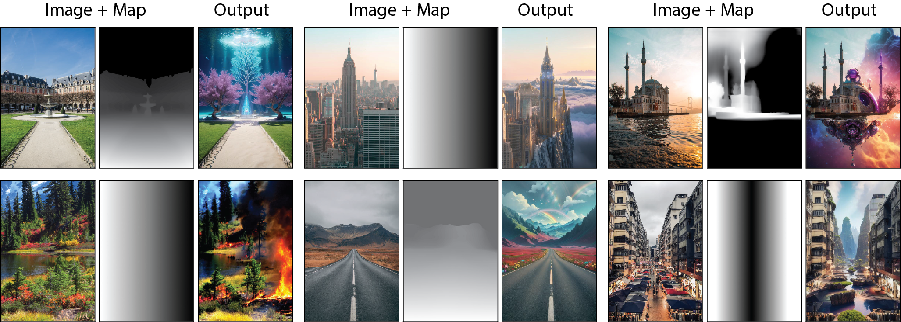

# Differential Diffusion: Giving Each Pixel its strength
> Eran Levin, Ohad Fried  
> Tel Aviv University, Reichman University  
> Diffusion models have revolutionized image generation and editing, producing state-of-the-art results in conditioned and unconditioned image synthesis. While current techniques enable user control over the degree of change in an image edit, the controllability is limited to global changes over an entire edited region. This paper introduces a novel framework that enables customization of the amount of change <i>per pixel</i> or <i>per image region</i>. Our framework can be integrated into any existing diffusion model, enhancing it with this capability. Such granular control on the quantity of change opens up a diverse array of new editing capabilities, such as control of the extent to which individual objects are modified, or the ability to introduce gradual spatial changes. Furthermore, we showcase the framework's effectiveness in soft-inpainting---the completion of portions of an image while subtly adjusting the surrounding areas to ensure seamless integration. Additionally, we introduce a new tool for exploring the effects of different change quantities. Our framework operates solely during inference, requiring no model training or fine-tuning. We demonstrate our method with the current open state-of-the-art models, and validate it via both quantitative and qualitative comparisons, and a user study.

<a href="https://arxiv.org/abs/2306.00950"></a>
<a href="https://differential-diffusion.github.io/"></a> 
<br/>
  
## Table of Contents

- [Requirements](#requirements)
- [Installation](#installation)
- [Usage](#usage)


## Requirements

- Python (version 3.9)
- GPU (NVIDIA CUDA compatible)
- [Virtualenv](https://virtualenv.pypa.io/) (optional but recommended)

## Installation

- Create a virtual environment (optional but recommended):

    ```bash
    python -m venv venv
    ```

    Activate the virtual environment:

    On Windows:

    ```bash
    venv\Scripts\activate
    ```

    On Unix or MacOS:

    ```bash
    source venv/bin/activate
    ```

- Install the required dependencies:

    ```bash
    pip install pip3 install torch torchvision --index-url https://download.pytorch.org/whl/cu118
    pip install -r requirements.txt
    ```

## Usage
- Ensure that your virtual environment is activated.
- Make sure that your GPU is properly set up and accessible.
- For Stable Diffusion 2.1:
  - Run the script:

    ```bash
    python SD2/run.py
    ```
- For Stable Diffusion XL:
  - Run the script:

    ```bash
    python SDXL/run.py
    ```
- For Kandinsky 2.2:
  - Run the script:

    ```bash
    python Kandinsky/run.py
    ```
    
- For DeepFloyd IF:
  - Run the script:

    ```bash
    python IF/run.py
    ```
    
## Citation
```bibtex
@misc{levin2023differential,
      title={Differential Diffusion: Giving Each Pixel Its Strength}, 
      author={Eran Levin and Ohad Fried},
      year={2023},
      eprint={2306.00950},
      archivePrefix={arXiv},
      primaryClass={cs.CV}
}
```
