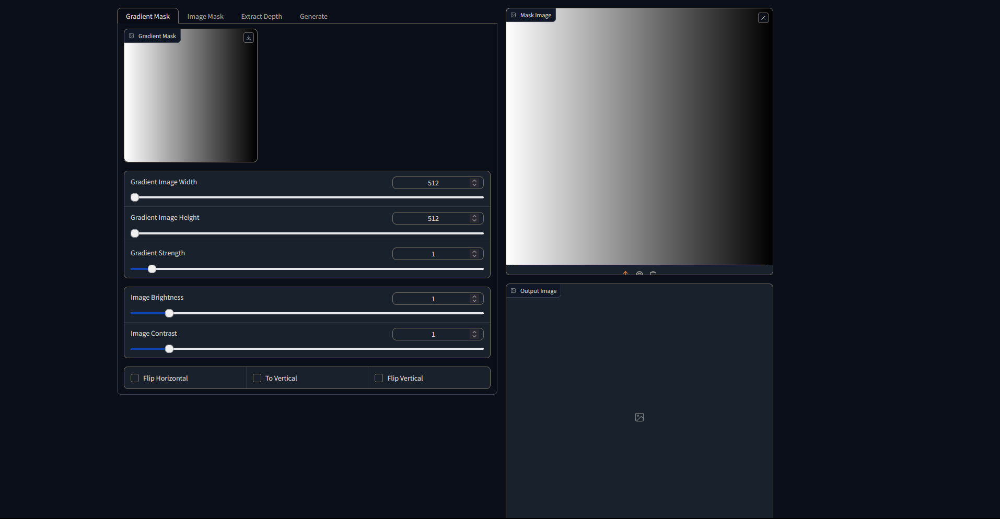
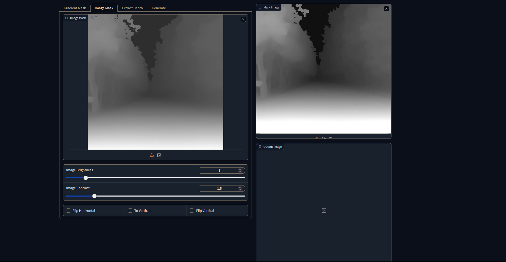
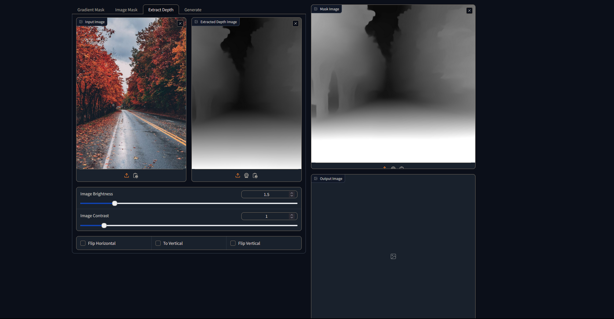
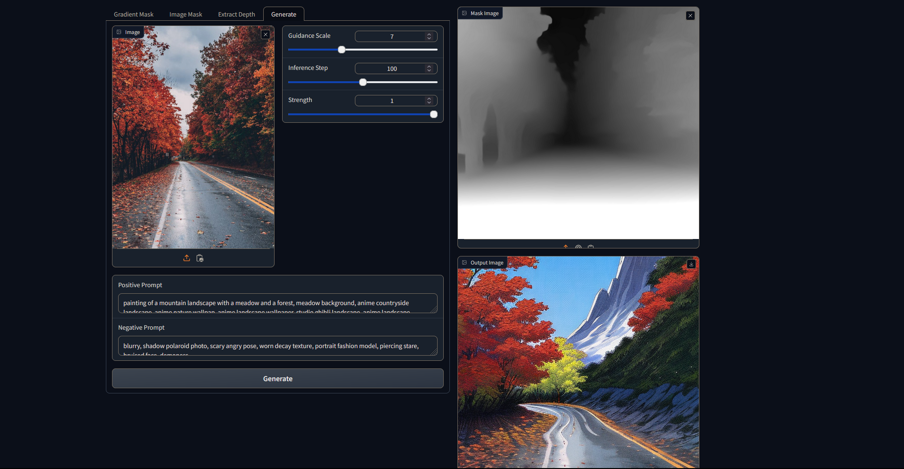

# Gradio Example

- Playground to test differential diffusion SD2 pipeline with different masks.

## Features
- Generate gradient mask on runtime.
- Import the mask image.
- Extract the depth image from the given image with [Intel/dpt-large](https://huggingface.co/Intel/dpt-large) model.
- Brightness, contrast and image transform functionalities for the mask images.
- Generate output with input image, positive and negative prompts, guidance scale, strength, number of inference steps parameters.

## Required Packages
- transformers
- accelerate
- torch
- diffusers
- gradio

## Usage
1. Go to ```differential-diffusion``` directory
2. Active the virtual environment if there is one
3. Run ```python examples/gradio/main.py``` command

## Tabs

- When changing between tabs, configured depth images are updated on the ```Mask Image```.

### Gradient Mask



|       Variable        | Definition                                          |
| :-------------------: | :-------------------------------------------------- |
|     Gradient Mask     | Temp gradient mask to use in calculations           |
| Gradient Image Width  | Define the width of the gradient image              |
| Gradient Image Height | Define the height of the gradient image             |
|   Gradient Strength   | Set the white and black ratios                      |
|   Image Brightness    | Set the gradient mask image's brightness            |
|    Image Contrast     | Set the gradient mask images's contrast             |
|    Flip Horizontal    | Flip the gradient mask image horizontally           |
|      To Vertical      | Rotate the gradient mask image 90 degrees clockwise |
|     Flip Vertical     | Flip the gradient mask image vertically             |

- ```Mask Image``` is updated when any variable ,except ```Gradient Mask```, value is changed

### Image Mask



|     Variable     | Definition                                                   |
| :--------------: | :----------------------------------------------------------- |
|    Image Mask    | The mask image can be uploaded as file or from the clipboard |
| Image Brightness | Set the input mask image's brightness                        |
|  Image Contrast  | Set the input mask images's contrast                         |
| Flip Horizontal  | Flip the input mask image horizontally                       |
|   To Vertical    | Rotate the input mask image 90 degrees clockwise             |
|  Flip Vertical   | Flip the input mask image vertically                         |

- ```Mask Image``` is updated when any variable value is changed

### Extract Depth



|       Variable        | Definition                                              |
| :-------------------: | :------------------------------------------------------ |
|      Input Image      | Original image which is used to extract the depth image |
| Extracted Depth Image | Showing the extracted depth image                       |
|   Image Brightness    | Set the extracted depth image's brightness              |
|    Image Contrast     | Set the extracted depth images's contrast               |
|    Flip Horizontal    | Flip the extracted depth image horizontally             |
|      To Vertical      | Rotate the extracted depth image 90 degrees clockwise   |
|     Flip Vertical     | Flip the extracted depth image vertically               |

- ```Mask Image``` is updated when any variable ,except ```Extracted Depth Image```, value is changed

### Generate



|    Variable     | Definition                                            |
| :-------------: | :---------------------------------------------------- |
|      Image      | Image for the differential diffusion Img2Img pipeline |
| Guidance Scale  | Guidance scale for the pipeline                       |
| Inference Step  | Number of inference steps for the pipeline            |
|    Strength     | Strength variable for the pipeline                    |
| Positive Prompt | Positive prompt for the pipeline                      |
| Negative Prompt | Negative prompt for the pipeline                      |

- The progress is started with ```Generate``` button.
- The generated output is showed in ```Output Image```.
- ```Mask Image``` has to have image otherwise generation will fail.
